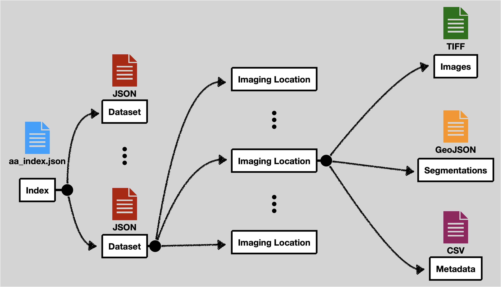

import Tabs from '@theme/Tabs';
import TabItem from '@theme/TabItem';

# Prepare Your Microscopy Data

> #### To use Loon, you must format your microscopy data according to Loon's requirements before uploading it.


## Learn: Expected Loon Data Format


> ### Data format Loon expects you to upload:
> - [**Index**](#define-your-experiments-aa_indexjson) `aa_index.json`: Define your cell imaging experiments _(E.g. Exp. 1, Exp. 2)_
> - [**Datasets**](#experiment-metadata-file) `.json`: Metadata about this experiment _(name of experiment, cell info names like `time`, `mass`)_
>   - **Imaging Location** folders each containing:
>     - Cell **Images** as a folder of `.tiff` files
>     - Cell [**Segmentations**](#segmentations-folder) (boundaries outlining each cell) as a folder of as `GeoJSON` files
>     - Cell **Metadata** as a `.csv` file _(cell's `id`, `mass`, `x`, `y` etc. over `time`)_
> <details>
>   <summary>Example file structure</summary>
> 
> ```
> your-microscopy-data/            # Your data file, choose any name
> ├── aa_index.json                # Defines your cell imaging experiments (e.g. Exp. 1, Exp. 2)
> ├── experiment_1/                # Your experiment file, any # of experiments, any names
> │   ├── experiment_1.json        # Required metadata about this experiment (name, etc.)
> │   ├── location_A/              # Your imaging location file, any # of loc's, choose any name
> │   │   ├── images_A/            # Folder of .tiff files (cell images)
> │   │   ├── segmentations_A/     # Folder of GeoJSON files (cell boundaries)
> │   │   └── Table_A.csv          # Cell metadata (id, mass, x, y, etc. over time)
> │   ├── location_B/
> │   │   ├── images_B/
> │   │   ├── segmentations_B/
> │   │   └── Table_B.csv
> │   └── ...                      # More locations as needed
> ├── experiment_2/
> │   └── ...
> └── ...
> ```
> </details>
>
> _Cell metadata and segmentations are not generated by Loon._  
> _As an initial step in your workflow, we recommend using software such as [LiveCyte](https://www.phasefocus.com/livecyte) and/or [TrackMate](https://imagej.net/plugins/trackmate/) to generate metadata._

## Loon Will Guide You
When uploading data, the Loon software **will prompt you** to:
> 1. **Create New Experiment**  
> 2. **Select Files**  
>    - Add one or more locations, each with unique ID  
>    - For each location, you select:  
>      - A `.zip` file of **images**  
>      - A `.zip` file of **segmentations**  
>      - A `.csv` file of **cell metadata**
> 3. **Define Column Variables**
>    - You map required variables _(e.g., frame, time, id, parent, mass, x, y)_ to columns in your cell metadata `.csv` file.
> 4. **Review**  
> 5. **Upload**
:::note
If using [**Local Loon**](./index.md), Loon will not guide you. You must prepare your microscopy data yourself.
:::
---
<Tabs>
  <TabItem value="index" label="Index">

## Define Your Experiments: `aa_index.json`

> This file contains a list of your experiment metadata files.  
> **Required:**
>   - `"experiments":` attribute.
>   - File must be in [`.json` format](https://www.w3schools.com/js/js_json_syntax.asp).  
> 
> Choose any names for your experiment files `e.g. "experiment_1.json"`
>
> #### `aa_index.json` File Example:
>
> ```json
> {
>   "experiments": [
>     "experiment_1.json",
>     "experiment_2.json",
>     "experiment_3.json",
>     "experiment_4.json",
>     "experiment_5.json",
>     "experiment_6.json",
>     "experiment_7.json"
>   ]
> }
> ```

  </TabItem>
  <TabItem value="datasets" label="Datasets">
## Datasets: Experiment Metadata File

> Each experiment metadata file is stored as a JSON file. This defines some metadata aspects of the experiment and points to the other data files.
>
> At the top level it expects the following attributes:
>
> | Attribute              | Definition                                                                                                                                                                                                                                                                                                              |
> | ---------------------- | ----------------------------------------------------------------------------------------------------------------------------------------------------------------------------------------------------------------------------------------------------------------------------------------------------------------------- |
> | `name`                 | Name of the experiment as it should appear in the Loon dashboard. |
> | `headers`              | The list of column names in the CSV feature tables. The order should match the CSV files.                                                                                                                                                                                                                               |
> | `headerTransforms`     | Defines the name of certain special columns (`time`, `frame`, `id`, `parent`, `mass`, `x`, `y`). This is optional if the name already exactly matches in headers. See [the table below](#header-transforms) for information about these special columns. |
> | `locationMetadataList` | A list of imaging location metadata. Each imaging location will include an `id`, `tabularDataFilename`, `imageDataFilename`, and `segmentationsFolder`. See [the table below](#location-metadata-list) for more information on each of these.             |
> | `compositeTabularDataFilename` | Specifies the path to the combined tabular data file. See the [section below](#composite-tabular-data-file) for  more information. |
>
> ### Header Transforms
>
> | Attribute | Definition                                                                                                                                                                         |
> | --------- | ---------------------------------------------------------------------------------------------------------------------------------------------------------------------------------- |
> | `frame`   | The frame number indicates which number image the data row comes from in a sequence of images.                                                                                     |
> | `time`    | The time when the image was recorded. Often this is relative to the start of the experiment. If this is not explicitly recorded, then the the frame number can be used as a proxy. |
> | `id`      | The unique ID for a particular tracked cell. This should be the same across frames for that cell's lifetime.                                                                       |
> | `parent`  | The `id` of the parent cell. If this is not tracked at all for an experiment, then map this column to the same one as the `id` column.                                             |
> | `mass`    | The mass of the cell.                                                                                                                                                              |
> | `x`       | The X coordinate for the cell's center position in pixel space. (It does not matter what definition of center is used.)                                                            |
> | `y`       | Same, but for the Y coordinate.                                                                                                                                                    |
>
> ### Location Metadata List
>
> | Attribute | Definition                                                                                                                                                                         |
> | --------- | ---------------------------------------------------------------------------------------------------------------------------------------------------------------------------------- |
> | `id`                  | A unique name for this location. Can be anything, but will be displayed in the interface, so a more descriptive name is better. |
> | `tabularDataFilename` | The location of the CSV file feature table for this experiment. |
> | `imageDataFilename`   | The location of the OME TIFF image file. This should be a `*.companion.ome` file. |
> | `segmentationsFolder` | This folder contains all of the segmentation files for a given location. See the [section on segmentations](#segmentations-folder) for more details. |
> | `tags`                | A JSON object containing key-value pairs that capture metadata about the particular location. See the [tags section](#tags) for more information and some examples. |
>
> So, altogether a single experiment metadata file should look something like the following:
>
> ```
> {
>   "name":"ExperimentOne",
>   "headers": [
>     "Frame",
>     "Tracking ID",
>     "Lineage ID",
>     "Position X (µm)",
>     "Position Y (µm)",
>     "Pixel Position X (pixels)",
>     "Pixel Position Y (pixels)",
>     "Volume (µm³)",
>     "Radius (µm)",
>     "Area (µm²)",
>     "Sphericity ()",
>     "Dry Mass (pg)",
>     "Track Length (µm)",
>     "Parent ID"
>   ],
>   "headerTransforms": {
>     "time": "Frame",
>     "frame": "Frame",
>     "id": "Tracking ID",
>     "parent": "Parent ID",
>     "mass": "Dry Mass (pg)",
>     "x": "Pixel Position X (pixels)",
>     "y": "Pixel Position Y (pixels)"
>   },
>   "compositeTabularDataFilename":"experiment1/composite_tabular_data_file.parquet",
>   "locationMetadataList": [
>     {
>       "id": "Condition A",
>       "tabularDataFilename": "experiment1/location_A/Table_A.csv",
>       "imageDataFilename": "experiment1/location_A/images_A.companion.ome",
>       "segmentationsFolder": "experiment1/location_A/segmentations_A",
>       "tags":{
>         "drug":"drug_1",
>         "concentration":"0.1"
>       }
>     },
>     {
>       "id": "Condition B",
>       "tabularDataFilename": "experiment1/location_B/Table_B.csv",
>       "imageDataFilename": "experiment1/location_B/images_B.companion.ome",
>       "segmentationsFolder": "experiment1/location_B/segmentations_B"
>       "tags":{}
>     },
>     {
>       "id": "Condition C",
>       "tabularDataFilename": "experiment1/location_C/Table_C.csv",
>       "imageDataFilename": "experiment1/location_C/images_C.companion.ome",
>       "segmentationsFolder": "experiment1/location_C/segmentations_C",
>       "tags":{
>         "drug":"drug_2",
>       }
>     }
>   ]
> }
> ```
>
> ### Tags
>
> Tags are used to define metadata about an individual location. This is used in the Loon UI to specify specific conditions corresponding to the location. The tags object has no restrictions. For example, locations have have completely different sets of tags, locations may have no tags, and locations can overlap on one more tags.
>
> For example, suppose we have three locations. Your tags may look like this:
>
> ```json
> [
>   {
>     "id": "location_1",
>     ...
>     "tags": {
>       "drug": "drug_1",
>       "concentration":"0.1"
>     }
>   },
>   {
>     "id": "location_2",
>     ...
>     "tags": {}
>   },
>   {
>     "id": "location_3",
>     ...
>     "tags": {
>       "drug": "drug_3"
>     }
>   }
> ]
> ```
>
> ### Composite Tabular Data File
>
> This key specifies the location (relative to the root of the current experiment directory) of a "combined metadata table" as a parquet file.
>
> This table must be the union of each of the individual location metadata csv files with an additional location column and the union of all tags separated as columns as well.
>
> For example, suppose we use the example from [tags section](#tags). Then, a sample of 6 rows of our parquet file would be something like this:
>
> | location | \{rest_of_headers\} | drug | concentration |
> |----------|-------------------|------|----------------|
> | location_1 | . . . | drug_1 | 0.1 |
> | location_1 | . . . | drug_1 | 0.1 |
> | location_2 | . . . |  |  |
> | location_2 | . . . |  |  |
> | location_3 | . . . | drug_3 |  |
> | location_3 | . . . | drug_3 |  |
>
> Here, the empty spaces denote empty strings.

</TabItem>
<TabItem value="segmentations" label="Segmentations">

## Segmentations Folder

> Each imaging location should have a corresponding folder that contains all of the segmentation files.  
> The names of the files must correspond to the imaging frame.  
> That is, `1.json` will contain all of the cell segmentations for the first frame, `2.json` will contain the second frame, and so on.  
> Each JSON file must follow the GeoJSON specification.  
> In addition to the standard geometry attribute, the `bbox` attribute must be defined.  
> To link the segmentations with the corresponding metadata, the cell `id` defined in the feature table must be included as an `ID` in the GeoJSON properties object.
>
> :::info
> Often, segmentations are instead generated as `*.roi` files.  
> When uploading using MinIO, Loon will automatically convert the `.roi` files to proper GeoJSON format.  
> If you are instead using Loon without MinIO (i.e. using Local Loon), you will have to convert the `.roi` files to GeoJSON yourself.  
> [Here](https://github.com/visdesignlab/aardvark-util/blob/main/roi_to_geojson.py) is a Python script which can convert `.roi` to GeoJSON from one of our accompanying repositories.
> :::
</TabItem>
</Tabs>