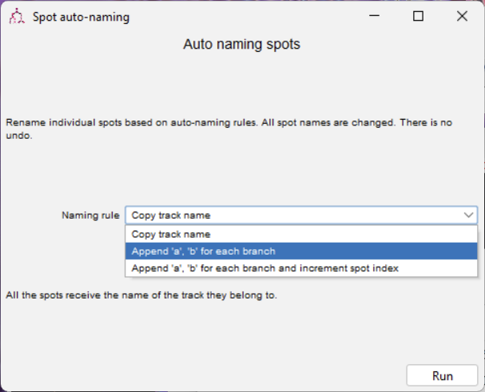

# Optional: Use Data from TrackMate

#### [TrackMate](https://imagej.net/plugins/trackmate/) is a popular FIJI (Image Analysis) plugin for:

- Robust tracking of cells and other objects in microscopy time-lapse images
- Various detection and tracking algorithms
- Visualization and analysis tools
- [Cellpose](https://www.cellpose.org/) is a cell segmentation algorithm for TrackMate:
  - Enables advanced object detection directly within the TrackMate workflow

## 1:&nbsp;&nbsp;&nbsp;Export Data from [TrackMate](https://imagej.net/plugins/trackmate/)

<!-- from Becca -->
### 1.1: Configure your experiment timelapse
> Open and set properties for a timelapse of interest (Image > Properties; update Channels, Slices, Frames, and Pixel dimensions as desired, these are carried over to TrackMate output and ultimately the Loon output.

### 1.2: Run Tracking
> Run tracking using TrackMate user interface with optimized tracking parameters for your specific dataset. After tracking is complete, and you are in the "Display Options" menu, manually correct tracks using TrackScheme as necessary.
>
> 

### 1.3: Define Cell Lineages
> After tracks have been manually corrected, click "next" (bottom right) to navigate to the final menu titled "Select an action", scroll down to select "Spot auto-naming", and select "Append 'a', 'b' for each branch. For each cell, each 'a' and 'b' cell are children.
>
> 
>
> The names should appear like this.
> 
> 

### 1.4: Export `.roi` Segmentations
> In the same "Select an action" menu, select "Export spots to IJ ROIS". This will save a .zip folder of ROIs that will be the segmentations into Loon. Click "Execute" (bottom right). Select "All spots" if you would like to export all ROIs to Loon.
>
> 

### 1.5: Export Cell Metadata `.csv`
> Once all tracks have been manually corrected, Click “Spots” on the bottom left of the “Display Options” menu. This will bring up the “All Spots Table”. Click “Export to CSV” (Top right) and save the file.

## 2:&nbsp;&nbsp;&nbsp;Convert TrackMate Data into [Loon Format](./data.md)

> We currently use [our conversion script on github](https://github.com/visdesignlab/aardvark-util/blob/main/ingest_trackmate.py). On GitHub, click the download button at the top-right of the script.
>
> ### Conversion Script Info:
>
> > **Inputs:**
> >
> > - A `.csv` file from TrackMate
> >   - Must currently include `LABEL`, `FRAME`, `POSITION_X`, `POSITION_Y` columns
> > - A folder containing `.roi` files from TrackMate
> >
> > **What the script does:**
> >
> > - Reads your `.csv` file, removes unnecessary rows / columns, sorts by frame
> > - Infers / Adds a `parent` column to the `.csv` file, which includes the parents of each track
> > - Outputs that corrected `.csv`
> > - Converts that corrected `.csv` to a `.parquet` file
> > - Converts `.roi` files to `GeoJSON` format, creating a folder structure based on frames
> >
> > **Outputs:**
> >
> > - A `metadata.csv` file with metadata for Loon
> > - A `metadata.parquet` file with metadata for Loon
> > - A segmentations folder with `GeoJSON` files for each frame
>
> ### Run the script:
>
> 1. Open your terminal:
>    - **Mac:** Press `Cmd + Space`, type `Terminal`, and press `Enter`
>    - **Windows:** Press `Win + R`, type `cmd`, and press `Enter`
> 2. Change to the directory where you saved `ingest_trackmate.py`:
>    - **Mac:** `cd ~/Downloads`
>    - **Windows:** `cd %USERPROFILE%\Downloads`
> 3. Run the script:
>    - Type `ingest_trackmate.py "/path/to/your/input.csv" "/path/to/your/roi_files" "/path/to/your/output"` and press `Enter`
>
> 

>
> 
**Optional:** New Conversion Script with User Interface

> ### Download our <a href="/convert_trackmate.py" download="convert_trackmate.py">new conversion script &#8595;</a>
> ### Run the script:
> 1. Open your terminal:
>    - **Mac:** Press `Cmd + Space`, type `Terminal`, and press `Enter`
>    - **Windows:** Press `Win + R`, type `cmd`, and press `Enter`
> 2. Change to the directory where you saved `convert_trackmate.py`:
>    - **Mac:** `cd ~/Downloads`
>    - **Windows:** `cd %USERPROFILE%\Downloads`
> 3. Run the script:
>    - Type `python convert_trackmate.py` and press `Enter`
> 4. Follow the on-screen instructions to convert your TrackMate data to Loon format
> 

<!-- TODO: point to something that exists -->
<!-- ## 3:&nbsp;&nbsp;&nbsp;Upload Formatted Data to Loon

> ### See: [Local Loon Upload](./quickstart.md)
>
> ### Option 2: [Server Upload](./loon-wrappers.md) -->
