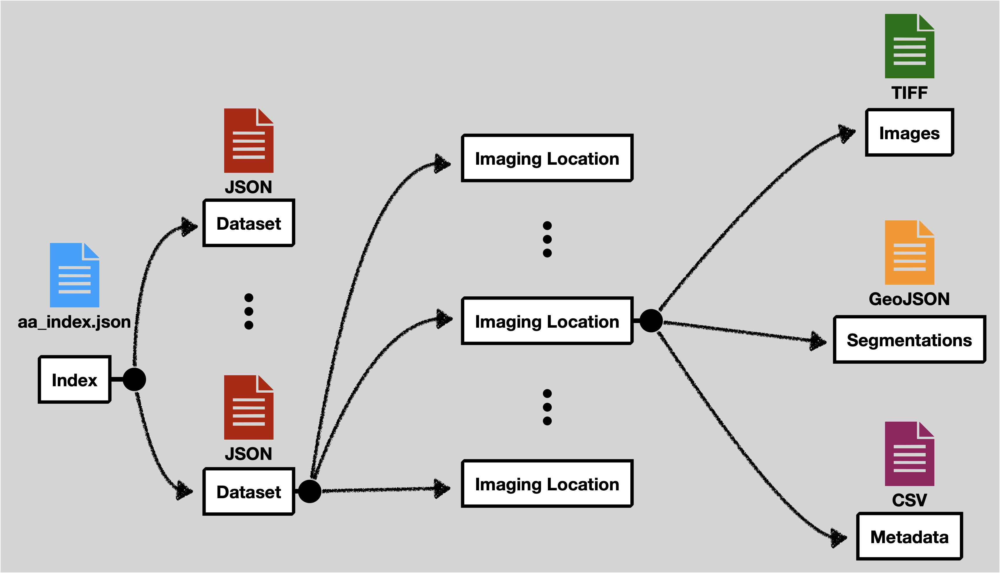

# Loon Data

At a high level the data expects feature tables as CSV, images as TIFF files, and cell segmentation boundaries as GeoJSON files. All of these files are explicitly linked together with JSON files.



<!-- An example data structure is included in this repository at `docs/data_example` -->

The location of the other files is flexible. The filenames should include the entire path relative to the base directory of the data set in your configuration.

:::note
When using Loon with MinIO enabled, data can only be added to Loon using the upload feature. This will standardize the naming conventions and locations of the files in that directory.
:::

## `aa_index.json`

This file contains a list of experiment metadata files. This file must contain an `experiments` attribute at the top level. The names of the experiment files can be anything, however, more descriptive names are better.

Example Content:

```json
{
  "experiments": [
    "experiment_1.json",
    "experiment_2.json",
    "experiment_3.json",
    "experiment_4.json",
    "experiment_5.json",
    "experiment_6.json",
    "experiment_7.json"
  ]
}
```

## `Experiment metadata file`

Each experiment metadata file is stored as a JSON file. This defines some metadata aspects of the experiment and points to the other data files.

At the top level it expects the following attributes:

| Attribute              | Definition                                                                                                                                                                                                                                                                                                              |
| ---------------------- | ----------------------------------------------------------------------------------------------------------------------------------------------------------------------------------------------------------------------------------------------------------------------------------------------------------------------- |
| `headers`              | The list of column names in the CSV feature tables. The order should match the CSV files.                                                                                                                                                                                                                               |
| `headerTransforms`     | Defines the name of certain special columns (`time`, `frame`, `id`, `parent`, `mass`, `x`, `y`). This is optional if the name already exactly matches in headers. See [the table below](https://github.com/visdesignlab/aardvark-util?tab=readme-ov-file#headertransforms) for information about these special columns. |
| `locationMetadataList` | A list of imaging location metadata. Each imaging location will include an `id`, `tabularDataFilename`, `imageDataFilename`, and `segmentationsFolder`. See [the table below](https://github.com/visdesignlab/aardvark-util?tab=readme-ov-file#locationmetadatalist) for more information on each of these.             |

### `headerTransforms`

| Attribute | Definition                                                                                                                                                                         |
| --------- | ---------------------------------------------------------------------------------------------------------------------------------------------------------------------------------- |
| `frame`   | The frame number indicates which number image the data row comes from in a sequence of images.                                                                                     |
| `time`    | The time when the image was recorded. Often this is relative to the start of the experiment. If this is not explicitly recorded, then the the frame number can be used as a proxy. |
| `id`      | The unique ID for a particular tracked cell. This should be the same across frames for that cell's lifetime.                                                                       |
| `parent`  | The `id` of the parent cell. If this is not tracked at all for an experiment, then map this column to the same one as the `id` column.                                             |
| `mass`    | The mass of the cell.                                                                                                                                                              |
| `x`       | The X coordinate for the cell's center position in pixel space. (It does not matter what definition of center is used.)                                                            |
| `y`       | Same, but for the Y coordinate.                                                                                                                                                    |

### `locationMetadataList`

`id` | A unique name for this location. Can be anything, but will be displayed in the interface, so a more descriptive name is better.
`tabularDataFilename` | The location of the CSV file feature table for this experiment.
`imageDataFilename` | The location of the OME TIFF image file. This should be a `*.companion.ome` file.
`segmentationsFolder` | This folder contains all of the segmentation files for a given location. See the [section on segmentations](#segmentations-folder) for more details.

So, altogether a single experiment metadata file should look something like the following:

```
{
  "headers": [
    "Frame",
    "Tracking ID",
    "Lineage ID",
    "Position X (µm)",
    "Position Y (µm)",
    "Pixel Position X (pixels)",
    "Pixel Position Y (pixels)",
    "Volume (µm³)",
    "Radius (µm)",
    "Area (µm²)",
    "Sphericity ()",
    "Dry Mass (pg)",
    "Track Length (µm)",
    "Parent ID"
  ],
  "headerTransforms": {
    "time": "Frame",
    "frame": "Frame",
    "id": "Tracking ID",
    "parent": "Parent ID",
    "mass": "Dry Mass (pg)",
    "x": "Pixel Position X (pixels)",
    "y": "Pixel Position Y (pixels)"
  },
  "locationMetadataList": [
    {
        "id": "Condition A",
        "tabularDataFilename": "experiment1/Table_A.csv",
        "imageDataFilename": "experiment1/images_A.companion.ome",
        "segmentationsFolder": "experiment1/segmentations_A/"
    },
    {
        "id": "Condition B",
        "tabularDataFilename": "experiment1/Table_B.csv",
        "imageDataFilename": "experiment1/images_B.companion.ome",
        "segmentationsFolder": "experiment1/segmentations_B/"
    },
    {
        "id": "Condition C",
        "tabularDataFilename": "experiment1/Table_C.csv",
        "imageDataFilename": "experiment1/images_C.companion.ome",
        "segmentationsFolder": "experiment1/segmentations_C/"
    }
  ]
}
```

## `Segmentations Folder`

Each imaging location should have a corresponding folder that contains all of the segmentation files. The names of the files must correspond to the imaging frame. That is `1.json` will contain all of the cell segmentations for the first frame., `2.json` will contain the second frame, and so on. Each json file must follow the GeoJSON specification. In addition to the standard geometry attribute, the `bbox` attribute must be defined. To link the segmentations with the corresponding metadata the cell `id` defined in the feature table must be included as an `ID` in the GeoJSON properties object.

:::info
Often, segmentations are instead generated as `*.roi` files. When uploading using MinIO, Loon will automatically convert the `.roi` files to proper GeoJSON format. If you are instead using Loon without MinIO (i.e. using Local Loon), you will have to convert the `.roi` files to GeoJSON yourself. [Here](https://github.com/visdesignlab/aardvark-util/blob/main/roi_to_geojson.py) is a Python script which can convert `.roi` to GeoJSON from on of our accompanying repositories.
:::
